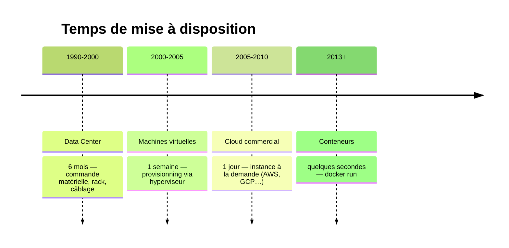
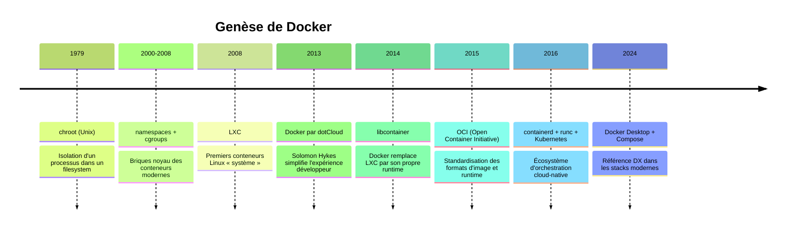
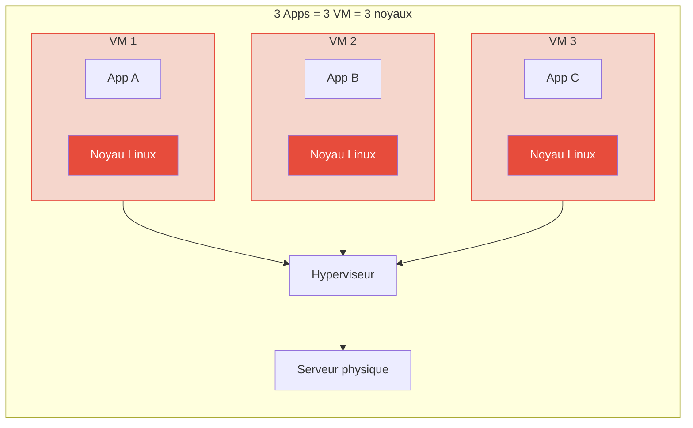
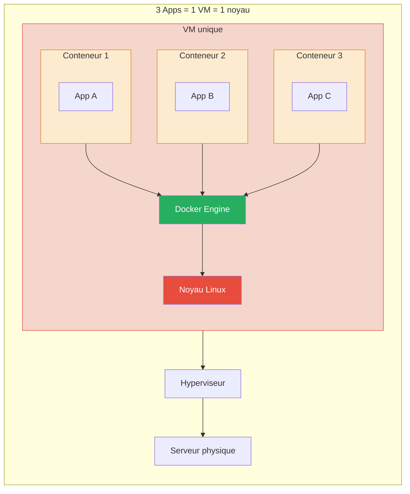
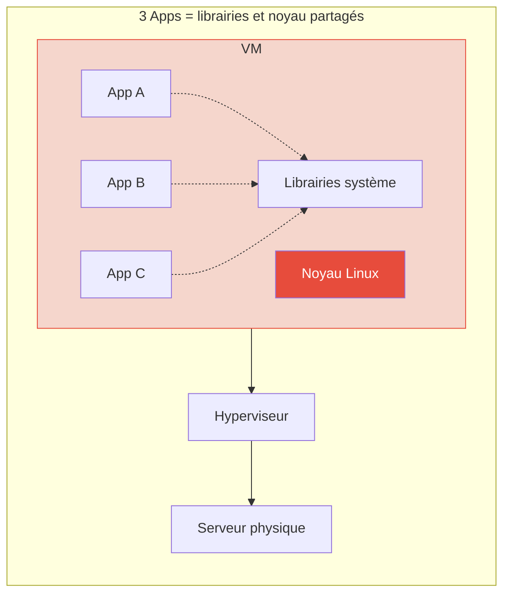
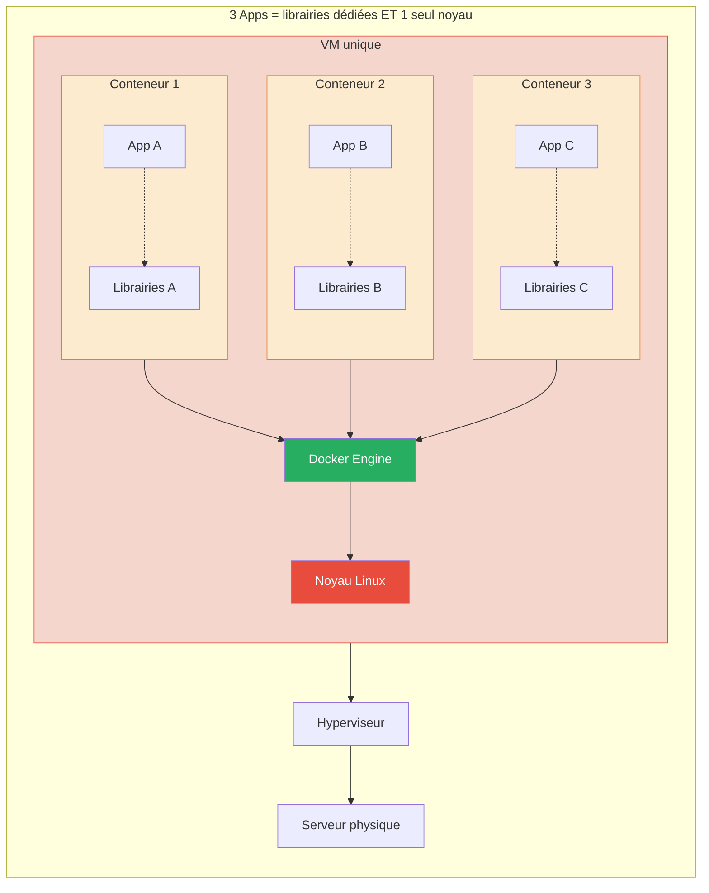
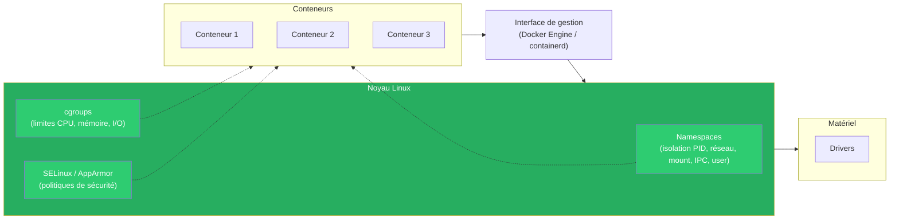
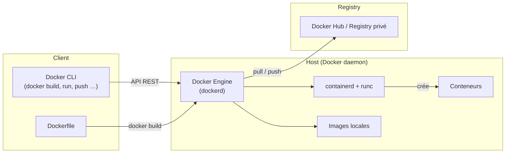

# Module 1 — Introduction à Docker

---
level: 2
---

# Objectifs du module

- Comprendre pourquoi Docker existe
- Distinguer machine virtuelle et conteneur
- Connaître les concepts : image, conteneur, registre

---
level: 2
---

# Pourquoi Docker ?

- "Ça marche sur ma machine" est un problème classique
- Docker encapsule l'application + ses dépendances
- Même environnement en local, en test et en production
- Démarrage rapide et isolation des services

---
level: 2
---

# L'analogie du conteneur maritime

- Avant : chaque marchandise transportée différemment (fragile, vrac, liquide…)
- Après : tout rentre dans un **conteneur standardisé**, quel que soit le contenu
- Docker applique la même idée au logiciel : **Build, Ship, Run**
- Un conteneur = un objet unique, versionné, portable, autosuffisant

---
level: 2
---

# Pet vs Cattle

| | Pet (animal de compagnie) | Cattle (bétail) |
|---|---|---|
| **Identité** | Nom unique (db-prod-01) | Numéro (instance-3472) |
| **Panne** | On le soigne, on le répare | On le remplace |
| **Mise à jour** | En place, avec précaution | On détruit et recrée |
| **Scaling** | Vertical (+ de CPU/RAM) | Horizontal (+ d'instances) |

- Les conteneurs favorisent l'approche **cattle** : jetable, reproductible, scalable

---
level: 2
---

# Le lead time infrastructure a toujours diminué



---
level: 2
---

# Historique et genèse de Docker

<div style="height: 400px; display: flex; align-items: center;">



</div>


---
level: 2
---

# Origines noyau Linux 
<br>

Docker réutilise :

- `namespaces` : isolent PID, réseau, points de montage, IPC, hostname et utilisateurs
- `cgroups` : limitent et mesurent CPU, mémoire, I/O
- Union filesystem (`overlay2`) : empilement de couches d'image, rapide et économe
- Capacités Linux + seccomp : réduction de la surface d'attaque côté runtime

<br>
<div class="bg-blue-100 border-l-4 border-blue-500 p-4 rounded">
  <strong>💡 Note :</strong> Docker n'a pas inventé les briques noyau, il a simplifié l'expérience développeur
</div>

---
level: 2
---

# Concurrents et alternatives

- Historiques : LXC/LXD, OpenVZ
- Runtime/CLI modernes : Podman, CRI-O, containerd (`ctr`, `nerdctl`)
- Initiative abandonnée mais marquante : rkt (CoreOS)
- Concurrence indirecte : VM (VMware, VirtualBox) et approches PaaS

---
level: 2
layout: two-cols-header
---

# VM vs Conteneur

:: left ::

- VM : 
  - un OS complet par machine virtuelle
  - plus lourde
  - isolation forte

::right::
- Conteneur : 
  - partage le noyau de l'OS hôte
  - plus léger
  - plus rapide à lancer

---
level: 2
layout: two-cols
---

# VM vs Conteneur


::right::

<div v-click>



</div>

---
level: 2
layout: two-cols
---

# VM vs Conteneur




::right::

<div v-click>


</div>

---
level: 2
---

# Avantages pour les développeurs

- Environnement d'exécution **portable** : même objet en dev, test, prod
- Bibliothèques et design **standardisés** (images officielles, Dockerfile)
- Facilité pour lancer une app **isolée** localement : tests rapides
- Partage simplifié via un **registre d'images**
- Philosophie **Build / Ship / Run**

---
level: 2
---

# Avantages pour les opérateurs

- **Cohérence** garantie entre les environnements
- Cycle de vie applicatif amélioré : **déploiements plus rapides**
- Sécurité renforcée (isolation, images signées, scanning)
- **Stateless** par défaut, avec possibilité de persistance
- Scalabilité facilitée, surtout avec un orchestrateur (Kubernetes)

---
level: 2
---

# Avantages pour les architectes

- Architecture **microservices** facilitée : 1 conteneur = 1 responsabilité
- **Densification** du système : plus d'apps sur moins de machines
- Réduction du **coût d'infrastructure**
- Flexibilité accrue avec un orchestrateur (placement, scaling, résilience)

---
level: 2
---

# Inconvénients et limites

- **Courbe d'apprentissage** : nouvel écosystème à maîtriser (images, réseau, volumes…)
- Les architectures d'hébergement sont **fondamentalement différentes** des VM
- Plus de liberté = **plus de responsabilité** pour les développeurs
- Sécurité : le **noyau est partagé** — isolation moins forte qu'une VM
- Applications stateful (bases de données) : nécessite une attention particulière

---
level: 2
---

# Qu'est-ce qu'un conteneur Linux ?



---
level: 2
---

# Architecture Docker

- Docker Engine : moteur qui crée et exécute les conteneurs
- Docker CLI : commande `docker` pour piloter le moteur
- Docker Hub/Registry : stockage et distribution d'images
- Dockerfile : recette de fabrication d'une image



---
level: 2
---

# Concepts clés

- Image : modèle en lecture seule
- Conteneur : instance en exécution d'une image
- Registre : dépôt d'images (public ou privé)
- Tag : version d'une image (ex : `nginx:1.27`)

---
level: 2
---

# TP 1 - Première exécution Docker

- Objectif : lancer un premier conteneur sans coder
- Commandes :

```bash
docker run --name hello-container hello-world
docker ps -a
docker rm hello-container
```

- Observation attendue : message de bienvenue Docker et cycle de vie du conteneur

---
level: 2
transition: slide-right
---

# Débrief et validation

- Pouvez-vous expliquer la différence image/conteneur ?
- Pourquoi un conteneur démarre plus vite qu'une VM ?
- Quelle est la valeur d'un registre dans un projet équipe ?
