# Module 1 — Introduction à Docker

---
level: 2
---

# Objectifs du module

- Comprendre pourquoi Docker existe
- Distinguer machine virtuelle et conteneur
- Connaître les concepts : image, conteneur, registre

---
level: 2
---

# L'analogie du conteneur maritime

<div class="flex justify-center">
  <div class="grid grid-cols-3 gap-4">
    <div v-click>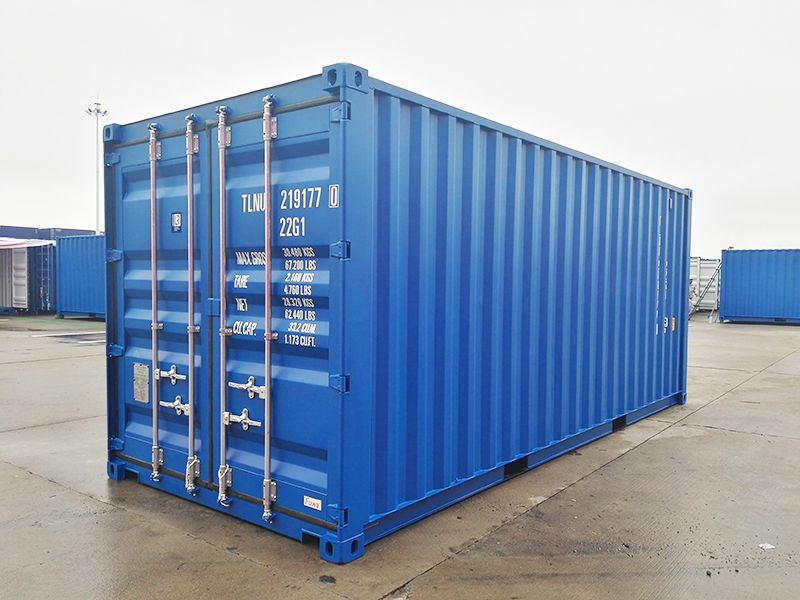</div>
    <div v-click></div>
    <div v-click>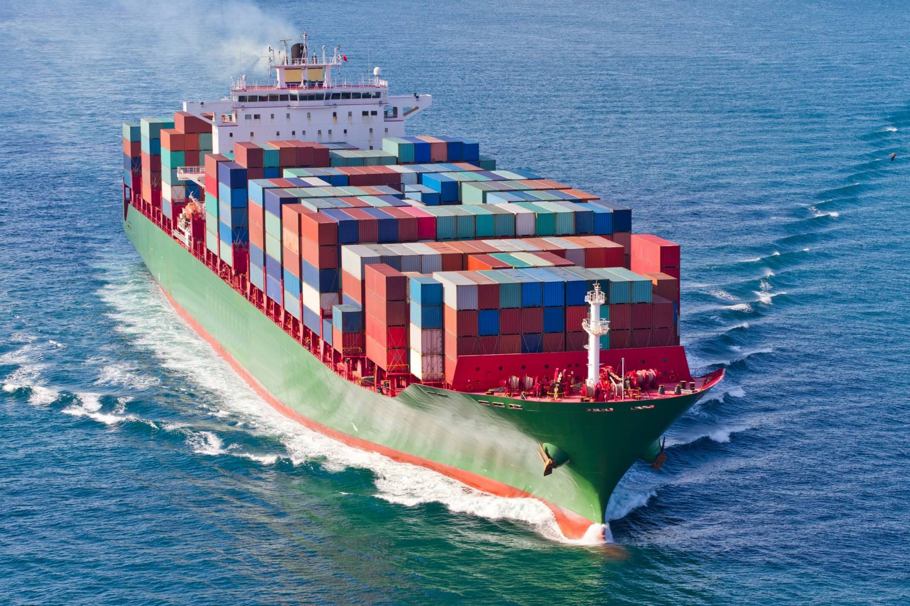</div>
  </div>
</div>

---
level: 2
---

# L'analogie du conteneur maritime

- **Standardisation** : tous les conteneurs ont la même taille (20 ou 40 pieds) → toute application rentre dans la même boîte Docker
- **Portabilité** : un conteneur passe du cargo au train au camion sans être ouvert → une image Docker s'exécute pareil sur laptop / CI/CD / prod
- **Isolation** : le contenu d'un conteneur ne pollue pas les autres → les conteneurs partagent l'OS mais ont leurs librairies
- **Densité** : 100+ conteneurs sur un bateau → 100+ conteneurs sur un serveur, bien utilisées les ressources
- **Reproductibilité** : même contenu, même trajet, même résultat → même image, même runtime, même comportement partout


---
level: 2
---

# Pet vs Cattle

| | Pet (animal de compagnie) | Cattle (bétail) |
|---|---|---|
| **Identité** | Nom unique (db-prod-01) | Numéro (instance-3472) |
| **Panne** | On le soigne, on le répare | On le remplace |
| **Mise à jour** | En place, avec précaution | On détruit et recrée |
| **Scaling** | Vertical (+ de CPU/RAM) | Horizontal (+ d'instances) |


<div class="bg-blue-100 border-l-4 border-blue-500 p-4 rounded">
  <strong>💡 Note :</strong> Les conteneurs favorisent l'approche <strong>cattle</strong> : jetable, reproductible, scalable
</div>

---
level: 2
---

# Le lead time infrastructure a toujours diminué

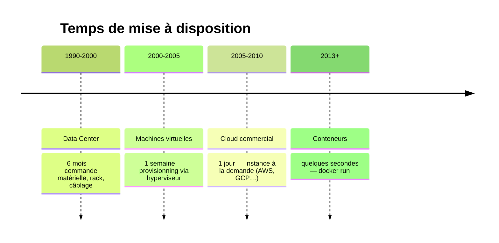

---
level: 2
---

# Historique et genèse de Docker

<div style="height: 400px; display: flex; align-items: center;">

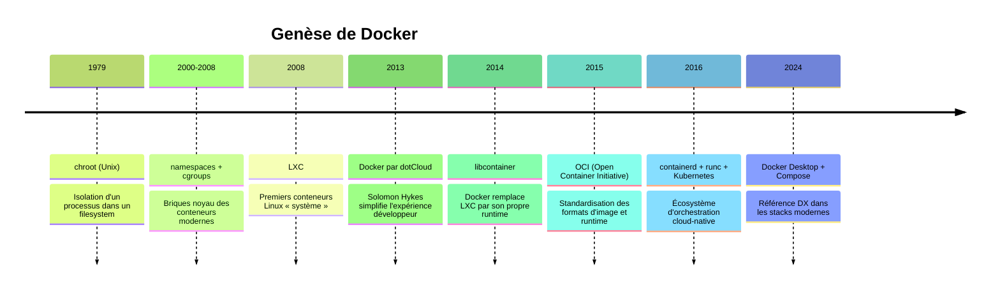

</div>


---
level: 2
---

# Origines noyau Linux 
<br>

Docker réutilise :

- `namespaces` : isolent PID, réseau, points de montage, IPC, hostname et utilisateurs
- `cgroups` : limitent et mesurent CPU, mémoire, I/O
- Union filesystem (`overlay2`) : empilement de couches d'image, rapide et économe
- Capacités Linux + seccomp : réduction de la surface d'attaque côté runtime

<br>
<div class="bg-blue-100 border-l-4 border-blue-500 p-4 rounded">
  <strong>💡 Note :</strong> Docker n'a pas inventé les briques noyau, il a simplifié l'expérience développeur
</div>

---
level: 2
---

# Concurrents et alternatives

- Historiques : LXC/LXD, OpenVZ
- Runtime/CLI modernes : Podman, CRI-O, containerd (`ctr`, `nerdctl`)
- Initiative abandonnée mais marquante : rkt (CoreOS)
- Concurrence indirecte : VM (VMware, VirtualBox) et approches PaaS

---
level: 2
layout: two-cols-header
---

# VM vs Conteneur

:: left ::

- VM : 
  - un OS complet par machine virtuelle
  - plus lourde
  - isolation forte

::right::
- Conteneur : 
  - partage le noyau de l'OS hôte
  - plus léger
  - plus rapide à lancer

---
level: 2
layout: two-cols
---

# VM vs Conteneur

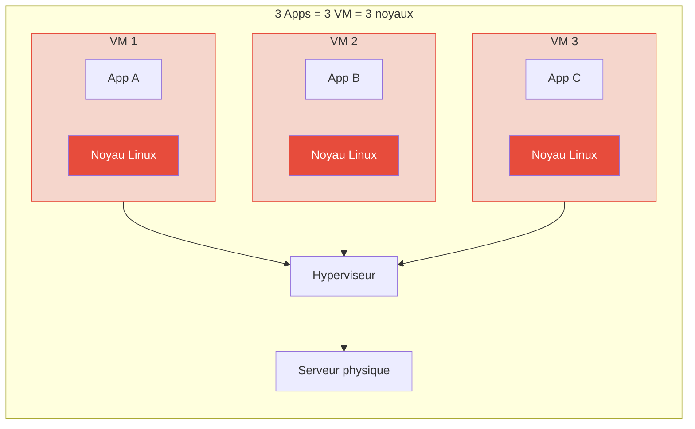
::right::

<div v-click>

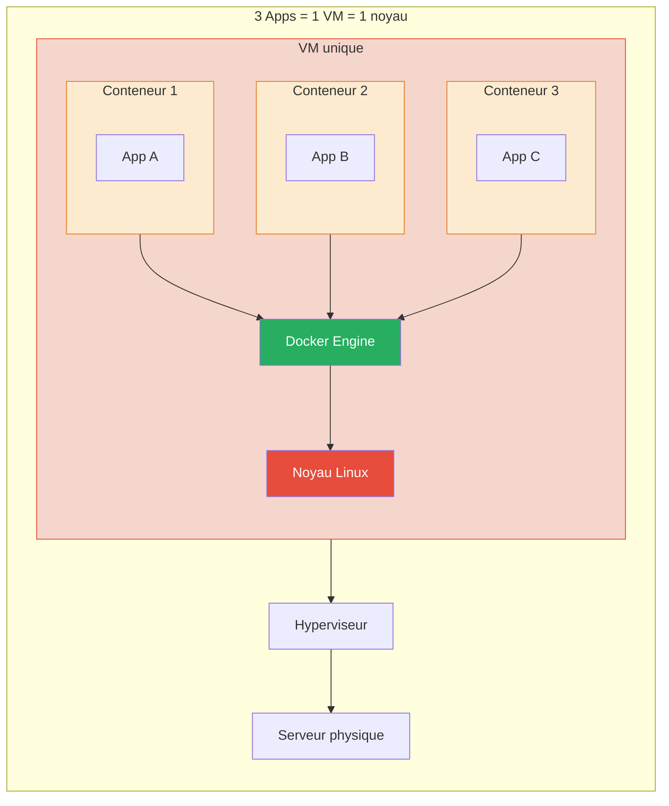

</div>

---
level: 2
layout: two-cols
---

# VM vs Conteneur


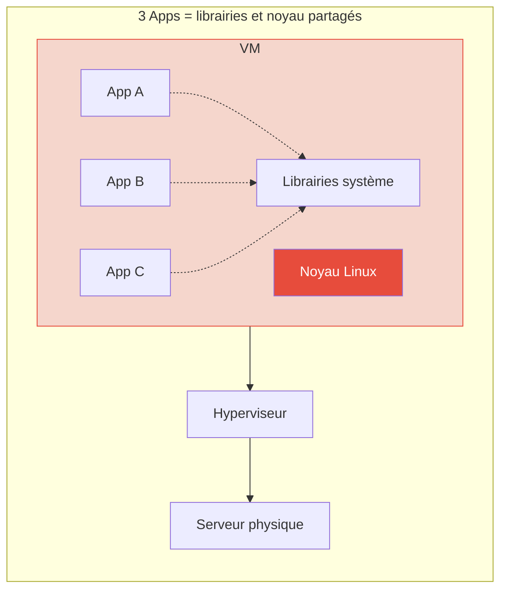

::right::

<div v-click>

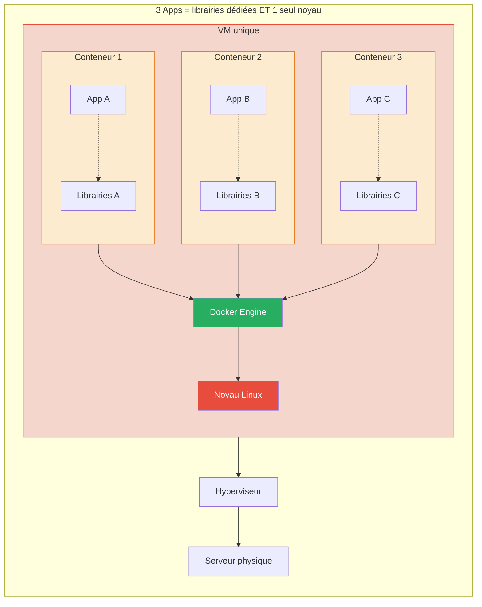
</div>

---
level: 2
---

# Avantages de Docker

- **Pour le développement** : environnement portable, exécution locale isolée, partage simplifié via registre d'images
- **Pour les opérations** : cohérence inter-environnements, déploiements plus rapides, sécurité et scalabilité améliorées
- **Pour l'architecture** : microservices facilités, meilleure densification des ressources, réduction des coûts d'infrastructure

<br>
<div class="bg-blue-100 border-l-4 border-blue-500 p-4 rounded">
  <strong>💡 Build / Ship / Run</strong> : un même artefact du poste dev jusqu'à la production.
</div>

---
level: 2
---

# Inconvénients et limites

- **Courbe d'apprentissage** : nouvel écosystème à maîtriser (images, réseau, volumes…)
- Les architectures d'hébergement sont **fondamentalement différentes** des VM
- Plus de liberté = **plus de responsabilité** pour les développeurs
- Sécurité : le **noyau est partagé** — isolation moins forte qu'une VM
- Applications stateful (bases de données) : nécessite une attention particulière

---
level: 2
---

# Qu'est-ce qu'un conteneur ?

- **Un fichier de description/génération** : le `Dockerfile` permet de construire l'image de façon reproductible.
- **Un objet stockable et versionné** : l'image peut être taggée (`app:1.0`) et publiée dans un registre.
- **Une version précise de l'application** : code, dépendances et configuration runtime sont figés dans l'image.
- **Un processus isolé et autosuffisant** : le conteneur embarque ses bibliothèques et s'exécute dans un environnement dédié.
- **Une identité réseau** : il peut exposer des ports et communiquer via un réseau Docker (nom DNS interne, IP, service).
- **Un cycle de vie maîtrisé** : on crée, exécute, arrête et recrée rapidement le conteneur sans dérive de configuration.

<div class="bg-blue-100 border-l-4 border-blue-500 p-4 rounded mt-4">
	<strong>💡 En résumé :</strong> une image est le modèle, le conteneur est son instance en cours d'exécution.
</div>


---
level: 2
---

# Architecture Docker

- Docker Engine : moteur qui crée et exécute les conteneurs
- Docker CLI : commande `docker` pour piloter le moteur
- Docker Hub/Registry : stockage et distribution d'images
- Dockerfile : recette de fabrication d'une image

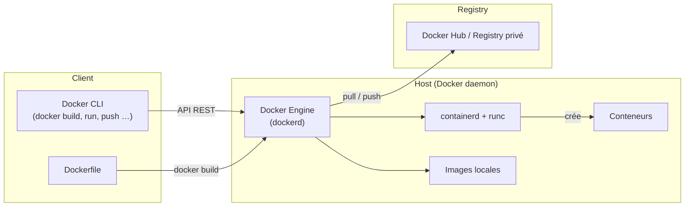

---
level: 2
---

# Concepts clés

- Image : modèle en lecture seule
- Tag : version d'une image (ex : `nginx:1.27`)
- Conteneur : instance en exécution d'une image
- <v-click at="1">Registre : dépôt d'images (public ou privé)</v-click>

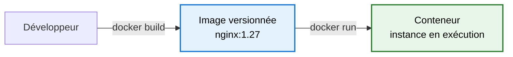

<div v-click at="1">

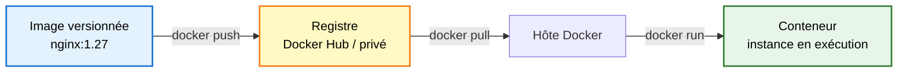

</div>

---
level: 2
---

# TP 1 - Première exécution Docker

- Objectif : lancer un premier conteneur sans coder
- Commandes :

```bash
docker run --name hello-container hello-world
docker ps -a
docker rm hello-container
```

- Observation attendue : message de bienvenue Docker et cycle de vie du conteneur

---
level: 2
transition: slide-right
---

# Débrief et validation

- Pouvez-vous expliquer la différence image/conteneur ?
- Pourquoi un conteneur démarre plus vite qu'une VM ?
- Quelle est la valeur d'un registre dans un projet équipe ?
