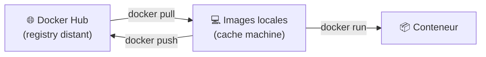
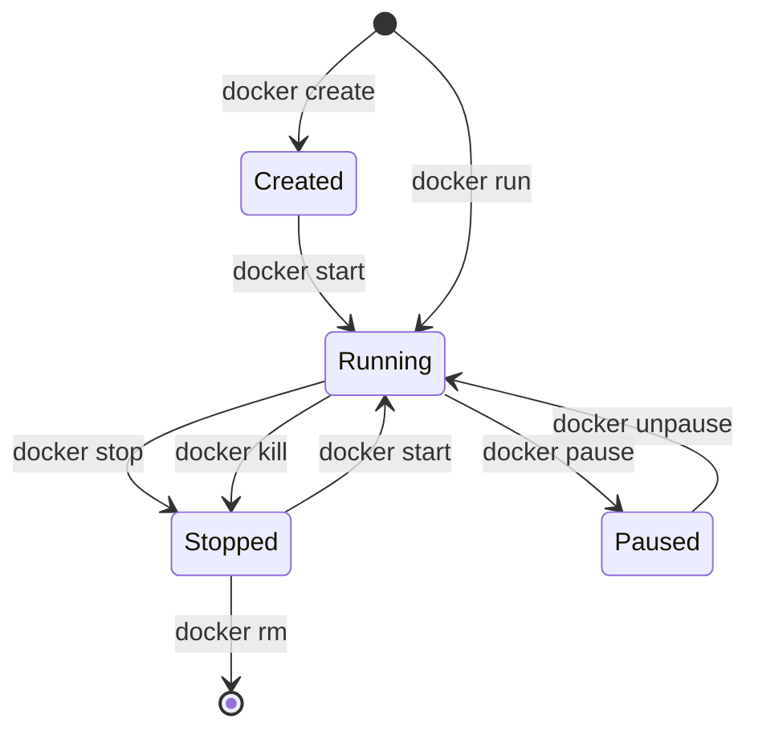
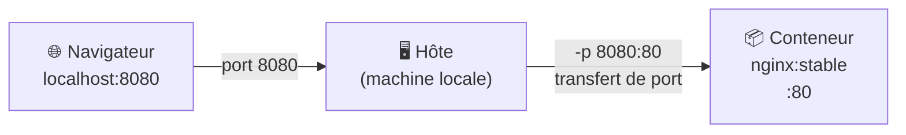
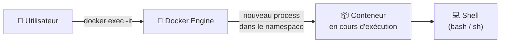

# Module 2 - Commandes essentielles Docker

---
level: 2
---

# Objectifs du module

- Prendre en main les commandes Docker de base
- Gérer le cycle de vie d'un conteneur
- Lire les logs et entrer dans un conteneur
- Exposer un service sur un port local

---
level: 2
---

# Les commandes à connaître

- `docker pull` : télécharger une image
- `docker images` : lister les images locales
- `docker run` : créer + démarrer un conteneur
- `docker ps` / `docker ps -a` : lister les conteneurs actifs / tous les conteneurs existants
<br><br><br>




---
level: 2
---

# Cycle de vie d'un conteneur

<div class="flex justify-center items-center flex-1">



</div>

---
level: 2
---

# Observer et dépanner

- Lire les journaux : `docker logs <nom>`
- Ouvrir un shell : `docker exec -it <nom> sh`
- Détails techniques : `docker inspect <nom>`
- Suivi ressources : `docker stats`

---
level: 2
---

# Publication de ports

- Format : `-p port_hote:port_conteneur`
- Exemple Web :

```bash
docker run -d --name web-nginx -p 8080:80 nginx:stable
```

- Résultat : application accessible sur `http://localhost:8080`

<br><br>


---
level: 2
---

# Entrer dans un conteneur : `docker exec`

- Ouvre un processus supplémentaire **dans** un conteneur déjà actif
- Ne redémarre pas le conteneur
- Option `-it` : mode interactif avec un terminal (`i` = stdin ouvert, `t` = pseudo-TTY)

```bash
# Ouvrir un shell bash
docker exec -it web-nginx bash

# Lancer une commande ponctuelle
docker exec web-nginx cat /etc/nginx/nginx.conf
```

<br>



---
level: 2
---

# TP 2 - Manipuler un serveur web

- Télécharger et lancer Nginx
- Vérifier l'état du conteneur
- Consulter les logs
- Entrer dans le conteneur pour voir les fichiers web

<div v-click>

```bash {none|1|1-2|1-3|1-4|1-5|1-6}{at: '2'}
docker pull nginx:stable
docker run -d --name web-nginx -p 8080:80 nginx:stable
docker ps
docker logs web-nginx
docker exec -it web-nginx sh
$ cat /usr/share/nginx/html/index.html
```

</div>
---
level: 2
transition: slide-right
---

# Débrief et validation

- Quelle commande utilise-t-on pour exposer un port ?
- Quelle différence entre `stop` et `rm` ?
- Pourquoi `exec` est utile en phase de debug ?
- Quel utilisateur est utilisé lors du `exec` ?
- Comment éditer le fichier index.html ?
