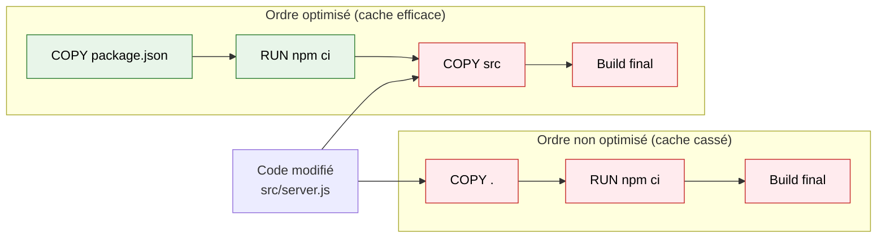

# Module 3 - Création d'images avec Dockerfile

---
level: 2
---

# Objectifs du module

- Comprendre la structure d'un Dockerfile
- Construire une image personnalisée
- Optimiser taille et temps de build
- Introduire les bonnes pratiques de base


---
level: 2
layout: two-cols-header
---

# Anatomie d'un Dockerfile

<br><br>

::left::

- `FROM` : image de base
- `WORKDIR` : dossier de travail
- `COPY` : copie des fichiers
- `RUN` : exécute des commandes au build
- `EXPOSE` : indique le port à publier
- `CMD` / `ENTRYPOINT` : commande de démarrage

::right::

```dockerfile {none|1|1-2|1-3|1-4|1-5|1-6}
FROM node:25-alpine
WORKDIR /app
COPY package*.json ./
RUN npm ci --omit=dev
EXPOSE 3000
CMD ["node", "server.js"]
```

---
level: 2
---

# Construire et lancer une image

```mermaid {scale: 0.5}
flowchart LR
  subgraph BUILD["📁 Build Context"]
    DF["Dockerfile"]
    PJ["package.json"]
    SRC["server.js"]
  end

  subgraph ENGINE["⚙️ Docker Engine"]
    PROC["Build Process"]
    LAYERS["Image Layers"]
  end

  subgraph REGISTRY["💾 Registry Local"]
    IMG["demo-app:1.0"]
  end

  subgraph RUNTIME["🚀 Runtime"]
    CTR["Conteneur actif"]
    PORT["→ Port 3000"]
  end

  BUILD -->|docker build| PROC
  PROC --> LAYERS
  LAYERS --> IMG
  IMG -->|docker run| CTR
  CTR --> PORT

  classDef buildStyle fill:#e3f2fd,stroke:#1976d2,stroke-width:2px,color:#000
  classDef engineStyle fill:#fff9c4,stroke:#f57f17,stroke-width:2px,color:#000
  classDef registryStyle fill:#e8f5e9,stroke:#388e3c,stroke-width:2px,color:#000
  classDef runtimeStyle fill:#ffebee,stroke:#d32f2f,stroke-width:2px,color:#000

  class BUILD buildStyle
  class ENGINE engineStyle
  class REGISTRY registryStyle
  class RUNTIME runtimeStyle
```

- Build : <code>docker build <span v-mark.green="2">-t demo-app:1.0</span><span v-mark.blue="1"> src/ </span></code>
- Lancer : <code>docker run -d --name demo-app -p 3000:3000 <span v-mark.circle.green="3">demo-app:1.0</span></code>

<div style="height: 320px; display: flex; align-items: center; justify-content: center;">



</div>

---
level: 2
layout: two-cols-header
layoutClass: gap-4
---

# Architecture détaillée d'une image

Une image Docker est un empilement de couches (ou **layers**) en lecture seule.<br>
Chaque instruction Dockerfile crée une nouvelle couche.

::left::
<div style="margin: 20px 0;">
```html {none|12-15|9-15|6-15|3-15|all}
┌─────────────────────────────────────────┐
│ Image: demo-app:1.0                     │
├─────────────────────────────────────────┤
│ Layer 4 (CMD, EXPOSE)                   │ Métadonnées
│ sha256:f4e5d6...                        │ ~1 KB
├─────────────────────────────────────────┤
│ Layer 2 (RUN npm ci --omit=dev)         │ ← ← ← Plus récent
│ sha256:d2c3b4...                        │ +45 MB
├─────────────────────────────────────────┤
│ Layer 1 (COPY package*.json, WORKDIR)   │
│ sha256:c1b2a3...                        │ +5 MB
├─────────────────────────────────────────┤
│ Layer 0 (FROM node:25-alpine)           │ ← ← ← Plus ancien
│ sha256:a0b1c2...                        │ 200 MB (base image)
└─────────────────────────────────────────┘
         Image totale : ~252 MB
```

</div>
::right::
<br>
```dockerfile {none|1|1-3|-4|1-6}{at: '1'}
FROM node:25-alpine
WORKDIR /app
COPY package*.json ./
RUN npm ci --omit=dev
EXPOSE 3000
CMD ["node", "server.js"]
```

<div v-click>

**Caractéristiques des couches**
- Hash unique **SHA256** par couche
- Immuables (lecture seule)
- Réutilisables entre conteneurs
- Économise espace disque

</div>

---
level: 2
layout: two-cols-header
layoutClass: gap-4
---

# Architecture détaillée d'une image

Au démarrage d'un conteneur, ajoute une couche en écriture.<br>
Cette couche **Thin R/W** capte les changements runtime sans modifier l'image d'origine.
::left::
<div style="margin: 20px 0;">

```html {1-8}{at: '1'}
┌─────────────────────────────────────────┐
│ Thin R/W Layer (Conteneur)              │ 
│ Modifications runtime                   │ 
├─────────────────────────────────────────┤
         ↑ créée au docker run ↑
┌─────────────────────────────────────────┐
│ Image: demo-app:1.0 (layers RO)         │
├─────────────────────────────────────────┤
│ Layer 4 (CMD, EXPOSE)                   │ 
│ sha256:f4e5d6...                        │
├─────────────────────────────────────────┤
│ Layer 2 (RUN npm ci --omit=dev)         │
│ sha256:d2c3b4...                        │
├─────────────────────────────────────────┤
│ Layer 1 (COPY package*.json, WORKDIR)   │
│ sha256:c1b2a3...                        │ 
├─────────────────────────────────────────┤
│ Layer 0 (FROM node:25-alpine)           │ 
│ sha256:a0b1c2...                        │ 
└─────────────────────────────────────────┘

```

</div>
::right::


**Thin R/W Layer**
- Ajoutée lors du `docker run`
- Seule couche en Écriture
- Perdue à la suppression du conteneur
- Écriture moins performante, surtout en I/O intensive
- Privilégier un volume pour la persistance et la performance


---
level: 2
---

# Cache et couches

- Chaque instruction crée une couche
- Modifier un fichier invalide des couches suivantes
- Copier d'abord les dépendances pour mieux réutiliser le cache
- Ordre des instructions = impact direct sur performance
<br><br>


---
level: 2
---

# Bonnes pratiques

- Utiliser des images officielles et légères (`alpine` quand possible)
- Éviter d'exécuter en root
- Ajouter un fichier `.dockerignore`
- Tagger les images avec des versions explicites

---
level: 2
layout: two-cols-header
layoutClass: gap-4
---

# TP 3 - Fichiers sources

Fichiers sources dans `src/tp3/`

::left::

**package.json**
<<< @/src/tp3/package.json

**server.js**
<<< @/src/tp3/server.js

::right::

**Dockerfile**
<<< @/src/tp3/Dockerfile


---
level: 2
---

# TP 3 - Créer et optimiser une image

- Créer un Dockerfile pour une mini app
- Construire l'image et la lancer
- Mesurer la taille de l'image
- Proposer une amélioration (base image, cache, nettoyage)

```bash
cd src/tp3
docker build -t tp-app:1.0 .
docker images | grep tp-app
docker run --rm -p 3000:3000 tp-app:1.0
```

---
level: 2
transition: slide-right
---

# Débrief et validation

- À quoi sert `FROM` ?
- Pourquoi l'ordre `COPY` / `RUN` est important ?
- Quelle bonne pratique appliquer en premier sur vos projets ?
