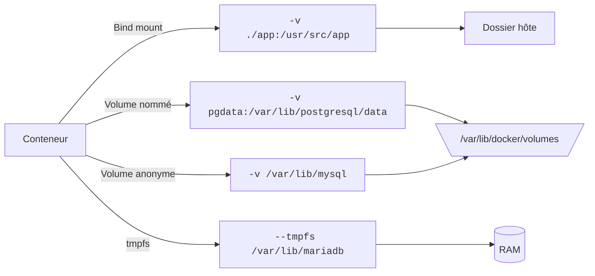

# Module 4 - Données et réseaux Docker

---
level: 2
---

# Objectifs du module

- Comprendre la persistance des données
- Utiliser volumes et bind mounts
- Configurer les conteneurs (variables d'environnement et fichiers)
- Créer un réseau Docker applicatif
- Connecter plusieurs conteneurs entre eux

---
level: 2
---

# Persistance des données

- Un conteneur est **éphémère** par nature
- Les données internes disparaissent à la suppression
- Les **volumes** permettent de conserver l'état
- Le stockage doit être pensé dès la conception

---
level: 2
---

# Types de volumes

| **Type** | **Description** | **Cas d'usage** |
|---|---|---|
| Bind mount | Dossier hôte monté dans le conteneur | Développement local, live reload |
| Volume nommé | Géré par Docker, persistant, portable | Données applicatives en production |
| Volume anonyme | Créé automatiquement sans nom explicite | Besoin ponctuel, moins traçable |
| tmpfs | Stockage en mémoire (RAM), non persistant | Données temporaires sensibles |

---
level: 2
---

# Types de volumes



---
level: 2
layout: two-cols-header
layoutClass: gap-4
---

# Configuration et variables d'environnement

Les variables d'environnement permettent de configurer les conteneurs sans modifier l'image.

::left::

**Passer des variables**
```bash
# Une variable
docker run -e VAR=valeur image

# Plusieurs variables
docker run -e VAR1=a \
  -e VAR2=b \
  -e VAR3=c \
  image
```

**Depuis un fichier**
```bash
docker run --env-file .env image
```

::right::

**Bonnes pratiques**
- Ne jamais hardcoder les secrets dans l'image
- Utiliser des fichiers `.env` locaux (ignorés par git)
- Documenter les variables requises
- Fournir des défauts sensibles

**Exemple `.env`**
```
DATABASE_URL=postgresql://user:pass@db:5432/app
LOG_LEVEL=info
API_KEY=secret-key-here
NODE_ENV=production
```

---
level: 2
layout: two-cols-header
layoutClass: gap-4
---

# Configuration par fichiers (volumes)

Monter des fichiers de configuration directement dans le conteneur pour surcharger les paramètres par défaut.

::left::

**Monter un fichier de config**
```bash
docker run -d \
  -v /path/to/config.yml:/etc/app/config.yml \
  my-app:1.0
```

**Monter un dossier complet**
```bash
docker run -d \
  -v ./config:/etc/nginx/conf.d \
  nginx:latest
```

**Config + variable d'env**
```bash
docker run -d \
  -v ./app.conf:/app/config.conf \
  -e PORT=3000 \
  my-app:1.0
```

::right::

**Cas d'usage**
- Nginx : surcharger `nginx.conf`
- Node : fichiers `.env` ou `config.json`
- PostgreSQL : custom `postgresql.conf`
- Application : fichiers de thème, locales

**Structure recommandée**
```
project/
├── config/
│   ├── nginx.conf
│   ├── app.config.json
│   └── logging.yml
├── Dockerfile
└── .dockerignore
```

<!--
💡 Bonnes pratiques
- Utiliser des chemins absolus en conteneur
- Tester la configuration locale avant de monter
- Documenter les fichiers attendus
- Combiner configs + variables pour flexibilité maximale
-->

---
level: 2
---

# Réseaux Docker

- Réseau par défaut : `bridge`
- Communication entre conteneurs via nom de service
- Isolation logique des applications
- Création réseau dédié :

```bash
docker network create app-net
```

---
level: 2
---

# Types de réseaux Docker

| Type | Cas d'usage | Remarques |
|---|---|---|
| `bridge` | Apps multi-conteneurs sur un seul hôte | Non distribué multi-hôtes |
| `host` | Performance réseau maximale, ports natifs | Moins d'isolation, conflits de ports |
| `none` | Isolation complète sans réseau | Aucun accès externe/interne |
| `overlay` | Services répartis sur plusieurs nœuds | Nécessite Swarm, plus complexe |
| `macvlan` | IP dédiée sur le LAN | Configuration réseau avancée |
| `ipvlan` | Forte densité de conteneurs | Dépend des contraintes infra |

---
level: 2
layout: two-cols-header
layoutClass: gap-4
---

# TP4 — Fichiers sources

Fichiers sources dans `src/tp4/`

::left::

**package.json**
<<< @/src/tp4/package.json

**Dockerfile**
<<< @/src/tp4/Dockerfile

::right::

**server.js**
<<< @/src/tp4/server.js

---
level: 2
layout: two-cols-header
layoutClass: gap-4
---

# TP4 — Mise en réseau et sauvegarde

::left::

- Créer un réseau
- Lancer la base de données PostgreSQL
- Construire l'image et lancer l'app connectée à PostgreSQL
- Vérifier la connexion via `/health`
- Écrire un message via `POST /messages`
- Lire les messages via `GET /messages`
- <v-click at="7">Bonus : Supprimer/recréer le conteneur et vérifier la persistance</v-click>

::right::

```bash {1|1-5|1-6|1-9|1-12|1-17|1-20}
docker network create app-net
docker run -d --name db --network app-net \
  -e POSTGRES_PASSWORD=secret \
  -v pgdata:/var/lib/postgresql/data \
  postgres:16
docker build -t tp4-app:1.0 src/tp4
docker run --rm -d --name app --network app-net \
  -e DB_HOST=db -e DB_PASSWORD=secret \
  -p 3000:3000 tp4-app:1.0

# Vérifier la connexion
curl http://localhost:3000/health

# Écrire un message
curl -X POST http://localhost:3000/messages \
  -H "Content-Type: application/json" \
  -d '{"content": "Hello Docker!"}'

# Lire les messages
curl http://localhost:3000/messages
```

---
level: 2
transition: slide-right
---

# Débrief et validation

- Quand choisir bind mount plutôt qu'un volume ?
- Pourquoi séparer les réseaux par application ?
- Comment garantir la persistance en cas de recréation du conteneur ?

<!--
Réponses attendues

- Bind mount : surtout en développement local (édition directe des fichiers, live reload). Volume nommé : préférable pour la persistance applicative en environnement stable/prod.
- Séparer les réseaux par application : limite le trafic inter-apps, réduit la surface d'exposition et clarifie l'architecture (isolation logique).
- Garantir la persistance : stocker les données dans un volume nommé (ou stockage externe), puis recréer le conteneur en remontant le même volume.
-->
